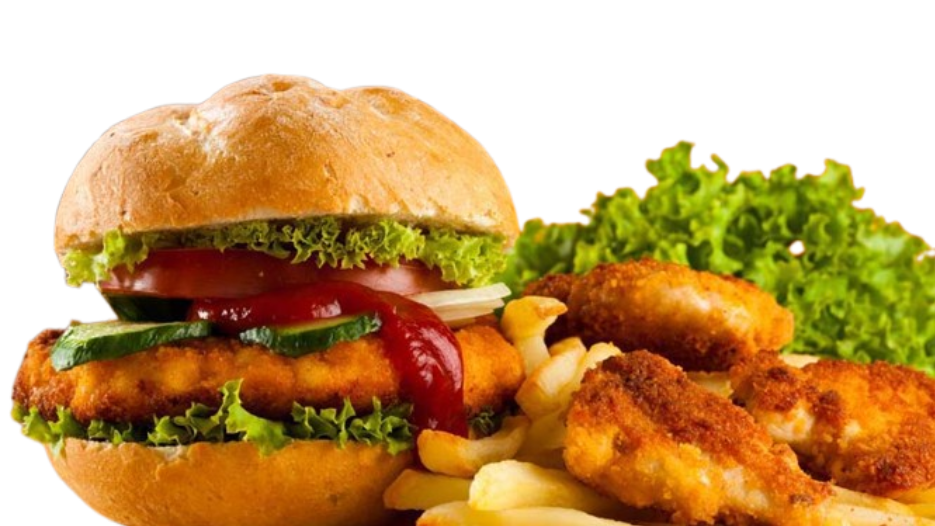

## 🍔  FoodWagon Clone - React Project



## Description
**FoodWagon Clone** est une application React qui simule une plateforme de commande de nourriture en ligne. POur ke moment elle est completement statique

## Technologies utilisées
- **React** : Bibliothèque JavaScript pour la construction d'interfaces utilisateur.
- **Bootstrap** : Framework CSS pour le design responsive.
- **Font Awesome** : Bibliothèque d'icônes pour les boutons et les éléments visuels.
- **CSS** : Styles personnalisés pour l'apparence du site.

## Installation
Suivez ces étapes pour installer et exécuter le projet localement.

### Prérequis
- Node.js et npm installés sur votre machine. Téléchargez-les [ici](https://nodejs.org/).

### Étapes d'installation
1. **Clonez ce dépôt sur votre machine locale** :
   ```bash
   git clone https://github.com/FokoJunior/foodwagon-react.git
   ```
2. **Accédez au dossier du projet** :
   ```bash
   cd foodwagon-react
   ```
3. **Installez les dépendances du projet** :
   ```bash
   npm install
   ```
4. **Démarrez le serveur de développement** :
   ```bash
   npm start
   ```
5. **Ouvrez votre navigateur et accédez à l'application** :
   ```
   http://localhost:3000
   ```

## Auteur
**FokoJunior**